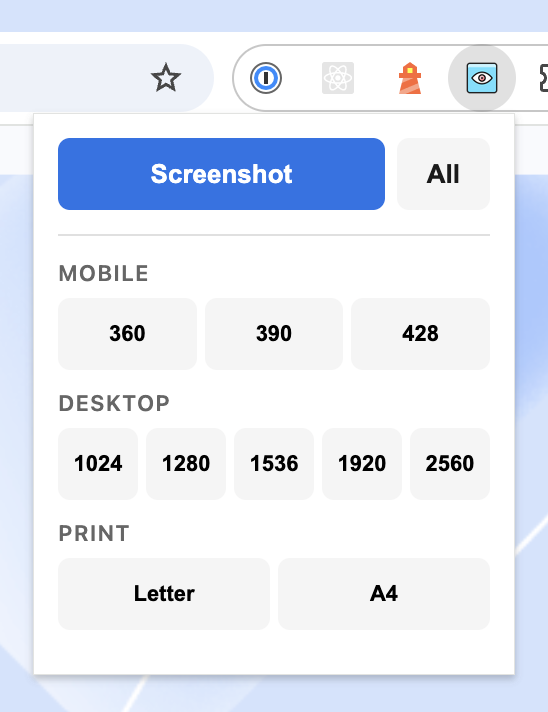

  

<h1 align="center">ResponsiveShot</h1>

  <strong>Full-page screenshots at every breakpoint. One click.</strong> 
  Stop resizing your browser window. Stop cropping in Photoshop. 
  Just pick a width and get a pixel-perfect PNG.

  <a href="#install">Install</a>&nbsp;&nbsp;|&nbsp;&nbsp;<a href="#usage">Usage</a>&nbsp;&nbsp;|&nbsp;&nbsp;<a href="#print-mode">Print Mode</a>&nbsp;&nbsp;|&nbsp;&nbsp;<a href="#why-these-presets">Why These Presets?</a>

  

---

## Why ResponsiveShot?

Responsive testing shouldn't require a 12-step workflow. Open the popup, tap a preset, done. ResponsiveShot uses the Chrome DevTools Protocol under the hood to emulate any viewport width — yes, even narrower than Chrome's minimum window size. No window resizing, no workarounds, no extensions that screenshot the wrong thing.

## Features

- **Full-page capture** — the entire page from top to bottom, not just what's visible
- **8 viewport presets** — mobile (360, 390, 428) and desktop (1024, 1280, 1536, 1920, 2560)
- **Batch mode** — hit "All" and get every breakpoint in one go
- **Print preview** — see exactly what your page looks like on paper (Letter / A4)
- **Accurate emulation** — real DevTools Protocol, not window hacks
- **Smart height** — measures actual content, ignores `min-height: 100vh` padding
- **Zero config** — no options page, no accounts, no cloud. Just screenshots.

## Install

### From source

1. Clone this repo
2. Open `chrome://extensions`
3. Enable "Developer mode"
4. Click "Load unpacked" and select the project folder

### Chrome Web Store

Coming soon.

## Usage

1. Navigate to any page
2. Click the ResponsiveShot icon
3. Pick a width — screenshot downloads instantly
4. Or hit **All** for every preset at once

Screenshots are saved as `screenshot-{width}-{timestamp}.png`.

### Print mode

The **Print** presets (Letter / A4) capture how the page looks when printed:

- Activates [`@media print`](https://developer.mozilla.org/en-US/docs/Web/CSS/CSS_media_queries/Printing) stylesheets
- Strips backgrounds and shadows — just like a real printer with "Background graphics" off
- Respects [`print-color-adjust: exact`](https://developer.mozilla.org/en-US/docs/Web/CSS/print-color-adjust) on elements that explicitly keep their backgrounds

Perfect for verifying your print styles before shipping. Saved as `print-{format}-{timestamp}.png`.

## Why these presets?

Most screenshot tools dump a blank width input on you and call it flexibility. We think that's a trap. More options don't lead to better testing — they lead to inconsistent breakpoints across your team, arbitrary widths no real user has, and time wasted deciding instead of shipping.

ResponsiveShot ships with **8 widths that cover the real world.**

### Mobile: 360 · 390 · 428

These three widths cover the vast majority of smartphones in use today. 360px captures older Android devices and the base-size Galaxy line. 390px is the iPhone 14/15/16 standard viewport. 428px covers the "Max" and "Plus" models. Together they account for [over 80% of mobile viewport widths](https://gs.statcounter.com/screen-resolution-stats/mobile/worldwide) in the wild.

### Desktop: 1024 · 1280 · 1536 · 1920 · 2560

These aren't random — they match the default breakpoints of [Tailwind CSS](https://tailwindcss.com/docs/responsive-design) (`lg`, `xl`, `2xl`) plus the two most common physical screen widths ([1920px at 19%](https://gs.statcounter.com/screen-resolution-stats/desktop/worldwide) and 2560px for high-end displays). If your CSS framework already uses these breakpoints, your screenshots will show exactly what each breakpoint triggers.

### Why not customizable?

Because the best defaults are the ones you never have to think about. Every team that "customizes" their breakpoints ends up with the same list plus one or two outliers nobody tests. We'd rather give you the right 8 and let you take all of them in one click.

## Permissions

| Permission | Why |
|---|---|
| `activeTab` | Access the current tab |
| `downloads` | Save PNGs to disk |
| `scripting` | Read viewport width |
| `debugger` | DevTools Protocol for emulation + capture |

## Credits

Icon by [Streamline](https://www.streamlinehq.com)

## License

[MIT License](LICENSE) — Copyright (c) 2026 [Sebastian Software GmbH](https://www.sebastian-software.com)
